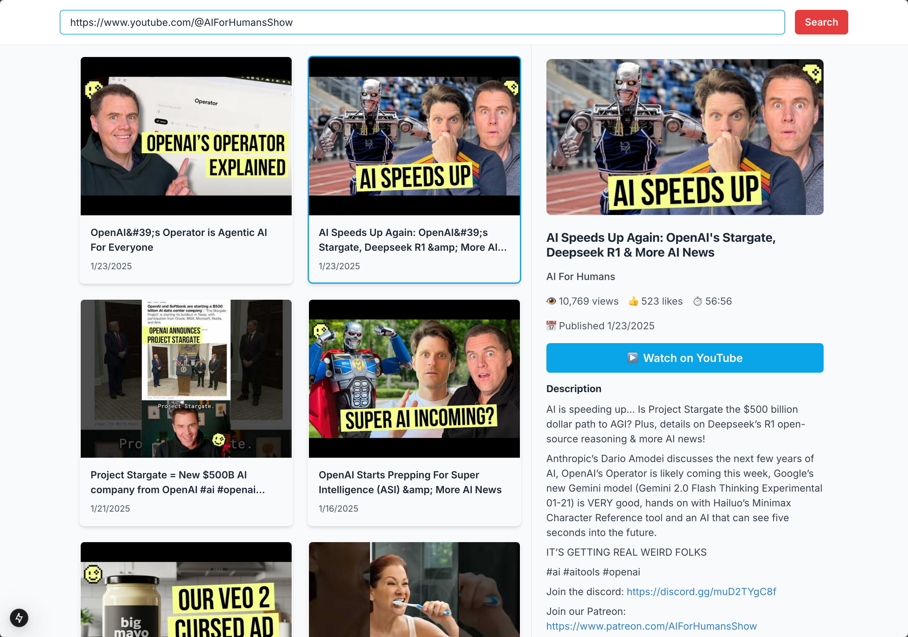

# YouTube Channeler

## About
This is a simple app that allows you to search for a YouTube channel and then see the videos from that channel.

## Installation

1. Clone the repository
2. Run `npm install`
3. Run `npm run dev`

## References
This project was created using the following references:

Simple Next.js Starter:
Start a new project with this simple starter using a single command.
https://github.com/bladnman/starter-nextjs-simple/blob/main/README.md

## License
This project is licensed under the MIT License. See the LICENSE file for details.

